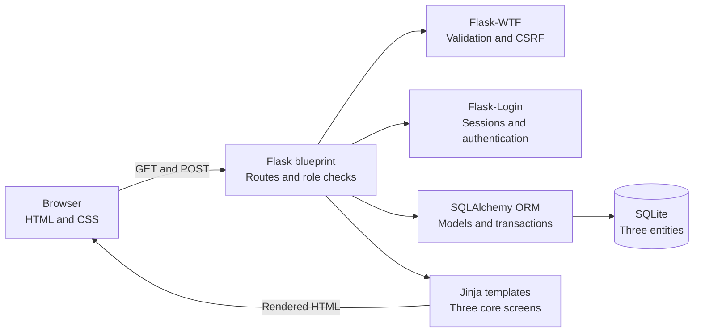
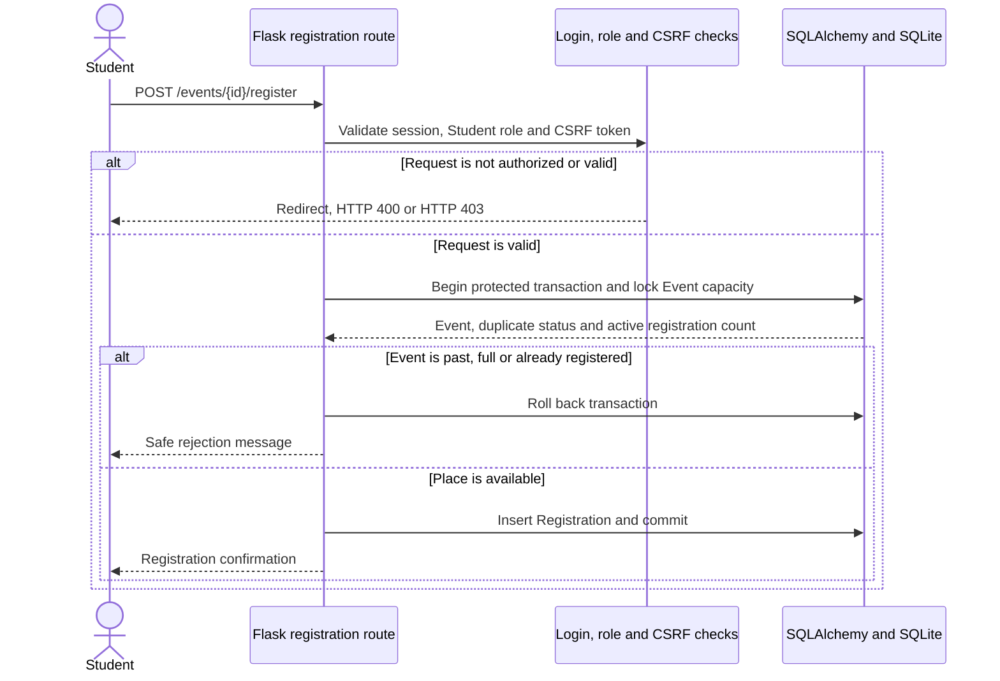
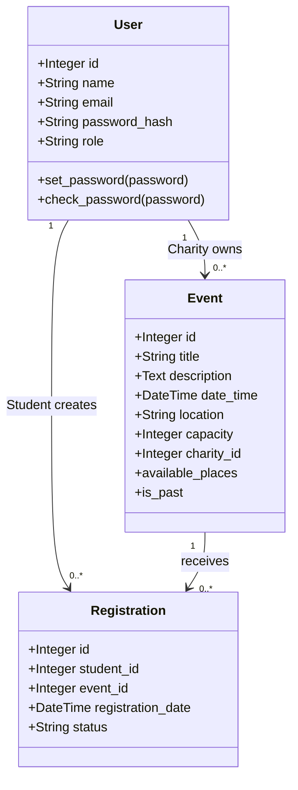

# Community Volunteer Board

A secure Flask prototype where local charities publish volunteer events and
students browse and register for available shifts.

## Contents

- [Problem statement](#problem-statement)
- [Team](#team)
- [Features and scope](#features-and-scope)
- [Technology stack](#technology-stack)
- [Installation and local run](#installation-and-local-run)
- [Three core screens](#three-core-screens)
- [System architecture](#system-architecture)
- [Database structure](#database-structure)
- [UML class diagram](#uml-class-diagram)
- [Testing](#testing)
- [AI-generated code review](#ai-generated-code-review)
- [Security audit](#security-audit)
- [Social responsibility](#social-responsibility)
- [ACM Code of Ethics](#acm-code-of-ethics)
- [Known limitations](#known-limitations)
- [Video pitch and demo](#video-pitch-and-demo)

## Problem statement

Local charities need a simple way to advertise volunteer opportunities and
manage shift interest. Students also need one place to discover upcoming events
and register without relying on scattered messages or manually maintained
spreadsheets. The Community Volunteer Board connects these two user groups while
keeping the prototype deliberately small enough to test, review and secure.

## Team

| Team member | Main responsibilities |
| --- | --- |
| Xu ([`zmxu546`](https://github.com/zmxu546)) | Database models, role-based dashboard, Charity event creation, Charity registration viewing, UML and ethics documentation |
| Utkarsh Thapa ([`utkarsh-thapa`](https://github.com/utkarsh-thapa)) | Flask setup, authentication, Student event registration, concurrency protection and security audit |
| Both | Planning, pull-request review, automated and manual testing, bug fixing, final README review and video presentation |

## Features and scope

### Implemented features

- Student and Charity account creation with securely hashed passwords.
- Login, logout and protected sessions using Flask-Login.
- A role-based Dashboard showing future opportunities to Students and owned
  events to Charities.
- Validated Charity event creation with a future date and positive capacity.
- Event Details with complete event information and available-place counts.
- Student registration with duplicate, past-event and full-capacity checks.
- Transaction protection that prevents simultaneous requests from overbooking
  the final place.
- An owner-only list of actively registered Student names. The query retrieves
  names only and does not expose Student email addresses.

### Scope boundaries

The prototype intentionally uses exactly three core screens and three database
entities. Event editing, deletion, registration cancellation, administration,
messaging, payments and production deployment are outside the assessed scope.

## Technology stack

- Python and Flask
- SQLite and Flask-SQLAlchemy
- Flask-Login and Flask-WTF
- Jinja, HTML and CSS
- Pytest
- Git and GitHub pull requests

## Installation and local run

From the repository folder:

```bash
python3 -m venv .venv
source .venv/bin/activate
python3 -m pip install -r requirements.txt
cp .env.example .env
```

Generate a secret value:

```bash
python3 -c "import secrets; print(secrets.token_hex(32))"
```

Replace the placeholder `SECRET_KEY` in the local `.env` file with that value,
then start the application:

```bash
python3 run.py
```

Open <http://127.0.0.1:5055>. The SQLite database is created locally and is not
committed to Git.

Never commit `.env`. Outside testing, the application rejects a missing,
whitespace-only, short or public-placeholder key. These checks do not prove
that a key is unpredictable; generating it with a cryptographically secure
source remains the operator's responsibility.

## Three core screens

| Screen | Student experience | Charity experience |
| --- | --- | --- |
| Account | Create a Student account or log in | Create a Charity account or log in |
| Dashboard | Browse future events in date order and open details | Create validated events and view owned events |
| Event Details | Inspect an event, view capacity and register once | Inspect an owned event and view active registered Student names |

POST actions such as login, event creation and registration return to one of
these three screens rather than introducing additional core screens.

## System architecture

The application uses a small server-rendered layered architecture. The browser
never talks directly to the database. Flask routes perform authentication and
authorization, Flask-WTF validates submitted forms and CSRF tokens, and
SQLAlchemy sends parameterized operations to SQLite.



### Student registration sequence



For Student registration, the server verifies the role, CSRF token, event date,
duplicate status and remaining capacity. SQLite obtains a write reservation
before capacity is read and holds it through the insert. Databases supporting
row-level locking use `SELECT ... FOR UPDATE` on the Event row.

## Database structure

| Entity | Purpose | Important constraints |
| --- | --- | --- |
| User | Stores Student and Charity accounts | Unique email, hashed password, role restricted to `student` or `charity` |
| Event | Stores volunteer opportunities | Positive capacity, future date enforced on creation, required owning Charity |
| Registration | Connects a Student to an Event | Unique Student/Event pair, status restricted to `registered` or `cancelled` |

Relationship rules are enforced with foreign keys and SQLAlchemy relationships:

- One Charity `User` can own many `Event` records.
- One Student `User` can have many `Registration` records.
- One `Event` can have many `Registration` records.
- A Student can have at most one Registration row for the same Event.

## UML class diagram



`User.id`, `Event.id` and `Registration.id` are primary keys. `Event.charity_id`,
`Registration.student_id` and `Registration.event_id` are foreign keys. The
role and status values also have database check constraints, and the
Student/Event pair has a database unique constraint.

## Testing

Run the complete automated suite:

```bash
python3 -m pytest -q
```

The current suite contains **73 passing tests**. Tests use isolated SQLite
in-memory databases, except for the concurrency test, which uses a temporary
database supplied by Pytest. Running tests does not modify the development
database.

| Test area | Evidence |
| --- | --- |
| Models and constraints | Relationships, unique values, roles, statuses and positive capacity |
| Authentication | Account creation, password hashing, login, logout and private routes |
| Charity events | Valid creation, invalid input, role checks and CSRF rejection |
| Dashboard | Role-specific event display, date ordering and ownership |
| Student registration | Success, duplicates, full and past events, CSRF and simultaneous final-place requests |
| Charity registration list | Ownership, active status, event isolation and personal-data minimization |
| Security audit | SQL injection, output escaping, cookie flags, secret validation and repository safety |

Final end-to-end and mobile usability evidence will be recorded under Issue #12
before the video is recorded.

## AI-generated code review

Generative AI was used for small, explicitly scoped changes. It did not make
the team's architecture, security or ethical decisions. For every AI-assisted
change, the team followed this process:

1. Request one small feature or test at a time.
2. Read and explain every generated line before committing it.
3. Compare the change with the three-screen and three-entity architecture.
4. Review server-side input validation, authentication and role permissions.
5. Review SQLAlchemy queries, CSRF protection, secrets and error handling.
6. Run focused tests, the complete automated suite and relevant manual checks.
7. Record the AI assistance and manual changes in the pull request.
8. Require the other team member to review and approve the pull request.

The team does not merge code it cannot explain. Both team members remain fully
responsible for the final implementation and documentation.

## Security audit

The team audited the completed prototype on 9 August 2026 against Issue #10 and
the relevant [OWASP SQL Injection Prevention](https://cheatsheetseries.owasp.org/cheatsheets/SQL_Injection_Prevention_Cheat_Sheet.html),
[OWASP CSRF Prevention](https://cheatsheetseries.owasp.org/cheatsheets/Cross-Site_Request_Forgery_Prevention_Cheat_Sheet.html)
and [OWASP Password Storage](https://cheatsheetseries.owasp.org/cheatsheets/Password_Storage_Cheat_Sheet.html)
guidance.

### Audit results

| Security check | Expected result | Actual evidence and result |
| --- | --- | --- |
| Password storage | No readable passwords in the database | `User.set_password` uses Werkzeug's salted password hashing and login uses `check_password_hash`. Authentication tests confirm the stored hash differs from the password. Passed. |
| Authentication | Private screens and actions require a valid session | Flask-Login protects the Dashboard, Event Details, event creation, event registration and logout routes. Unauthenticated GET and POST tests are redirected to the account screen. Passed. |
| Role and ownership authorization | Students and Charities can perform only their permitted actions | Server-side checks block Students from creating events, block Charities from registering, return HTTP 403 to non-owning Charities and expose registration names only to the event owner. Passed. |
| Input validation and CSRF | Invalid input and forged state-changing requests are rejected | WTForms validates length, email, role, date and capacity. Flask-WTF protects every POST form. Missing-token tests cover login, account creation, logout, event creation and event registration. Passed. |
| SQL injection | SQL-like input is treated only as data | All application-data queries use SQLAlchemy expressions and bound values. The only static SQL statement is the parameter-free SQLite transaction command `BEGIN IMMEDIATE`; no user value is joined to it. Runtime injection evidence is recorded below. Passed. |
| Secrets and sessions | The application rejects clearly unsafe key formats and the operator supplies a random key | `SECRET_KEY` is loaded from `.env`; production strips surrounding whitespace and rejects missing, whitespace-only, short and known-placeholder values. Secure randomness remains the operator's responsibility. Session cookies are `HttpOnly` and `SameSite=Lax`, and Flask-Login uses strong session protection. Passed. |
| Repository hygiene | Secrets and local databases are not published | `.env`, `instance/`, `*.db`, `*.sqlite` and `*.sqlite3` are ignored. Current files and complete Git object names were checked; none of these private files are tracked. Passed. |
| Error and output safety | Responses reveal no stack trace, query internals, password or executable user HTML | Login and validation failures use generic messages. Regression tests confirm no traceback, SQLAlchemy details or password disclosure, and Jinja escapes submitted HTML. Passed. |
| Capacity integrity | Concurrent requests cannot overbook an event | Registration capacity is read and written inside one protected transaction; a two-client concurrency test confirms only one Student receives the final place. Passed. |

### Required SQL injection test

- **Target:** the login database lookup.
- **Input:** email `or'1'='1@example.com` and password `' OR '1'='1`.
- **Expected:** authentication is rejected, the private Dashboard remains
  inaccessible, and no database row is exposed, added, changed or removed.
- **Actual:** login returned HTTP 400 with the generic `Invalid email or
  password` message; the Dashboard still redirected to login; the original
  User was unchanged and remained the database's only User.
- **Static review:** no route builds SQL by concatenating or formatting user
  input. SQLAlchemy generates bound parameters for email, ID, role, status and
  ownership filters.
- **Result:** no SQL injection vulnerability was reproduced.

### Finding, change and retest

The audit found one configuration weakness: a non-test application previously
accepted the public example `SECRET_KEY`, another very short key or a key made
only of whitespace. Those values could weaken the integrity of session and CSRF
signatures. Startup validation now removes surrounding whitespace before
checking length and rejects missing, whitespace-only, short and known-placeholder
values. The application enforces these format checks; the operator remains
responsible for generating the value with a cryptographically secure source.
Regression tests cover each rejected case and accepted-key normalization.

After the change, the focused security tests passed and the complete suite
reported **73 passed**. Dependency consistency, Python compilation and diff
format checks are also part of the pull-request verification.

This is a local prototype. Any future public deployment must additionally use
HTTPS, enable `SESSION_COOKIE_SECURE`, add login rate limiting and repeat the
audit against its production database and hosting configuration.

## Social responsibility

The Community Volunteer Board will not exploit, sell or repurpose user data.
It collects only information needed for the prototype's stated functions:
account name, email, password hash, role, event details and registration links.
Readable passwords are never stored.

Access is purpose-limited. Students can browse events and see only their own
registration state. A Charity can see only its own events and only the names of
Students with active registrations for those events. The registration-list
query does not retrieve Student email addresses. Demonstrations use fictional
accounts and events, and no real Student personal information belongs in the
repository, screenshots or video.

The team is responsible for correcting harmful defects, reporting security
limitations honestly and avoiding interface choices that pressure users into
sharing unnecessary information. A future production version would also need a
clear privacy notice, retention period and user-access and deletion process.

## ACM Code of Ethics

The project applies the [ACM Code of Ethics and Professional Conduct](https://www.acm.org/code-of-ethics)
to specific engineering decisions:

- **1.2 Avoid harm:** capacity and concurrency controls reduce incorrect
  registrations, while testing and safe errors reduce avoidable user harm.
- **1.6 Respect privacy:** the system minimizes stored and displayed personal
  data and limits registration names to the owning Charity.
- **2.5 Give comprehensive evaluations:** security findings, SQL injection
  evidence, limitations and retest results are documented rather than hidden.
- **2.9 Design robustly and securely:** password hashing, CSRF protection,
  parameterized queries, server-side authorization and peer review are required.

These commitments apply to both the code and the final demonstration. Meeting a
deadline does not justify merging code the team cannot explain or exposing real
personal data.

## Known limitations

- The application is a local Flask and SQLite prototype, not a production
  deployment. Production requires HTTPS, secure cookies and a production WSGI
  server.
- Accounts do not have email verification, password reset, multi-factor
  authentication or login rate limiting.
- Events cannot yet be edited or deleted, and Students cannot cancel a
  registration through the interface.
- There is no administrator moderation, charity verification, notification,
  search, filtering or pagination.
- Dates use the server's local time and do not include user-selectable time
  zones.
- Self-service data export, retention and account deletion controls are not
  implemented in this prototype.

## Video pitch and demo

The final ten-minute video link will be added here after Issue #13 is completed.
Both team members will speak, and the demonstration will use fictional data.
